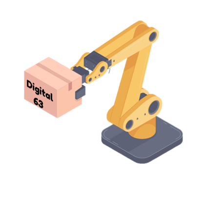

<!-- PROJECT SHIELDS -->

[![Contributors][contributors-shield]][contributors-url]
[![MIT License][license-shield]][license-url]

<!-- PROJECT LOGO -->
 

  

  <h3 align="center">Digital System Fundamentals Assigment</h3>

  

     
     
    <a href="https://github.com/MrNithi/digital-system-fundamentals-assignment/issues">Report Bug</a>
    ·
    <a href="https://github.com/MrNithi/digital-system-fundamentals-assignment/issues">Request Feature</a>
  

<!-- TABLE OF CONTENTS -->

  
Table of Contents

  <ol>
    <li>
      <a href="#about-the-project">About The Project</a>
      <ul>
        <li><a href="#built-with">Built With</a></li>
      </ul>
    </li>
    <li>
      <a href="#getting-started">Getting Started</a>
      <ul>
        <li><a href="#prerequisites">Prerequisites</a></li>
        <li><a href="#installation">Installation</a></li>
      </ul>
    </li>
    <li><a href="#usage">Usage</a></li>
    <li><a href="#roadmap">Roadmap</a></li>
    <li><a href="#contributing">Contributing</a></li>
    <li><a href="#license">License</a></li>
    <li><a href="#contact">Contact</a></li>
    <li><a href="#acknowledgements">Acknowledgements</a></li>
  </ol>

<!-- ABOUT THE PROJECT -->

## About The Project

&nbsp;&nbsp;&nbsp;&nbsp;&nbsp;&nbsp; อวกาศพรมแดนด่านสุดท้ายนี่คือการเดินทางของยานอวกาศ CE กับภาระกิจต่อเนื่องสำรวจโลกใหม่ที่ไม่รู้จักเพื่อเสาะหาชีวิตใหม่และอารยธรรมใหม่ๆ เพื่อก้าวไปอย่างห้าวหาญ ณ ที่ ๆ ไม่เคยมีมนุษย์ใดไปมาก่อน ดาวอังคารถือเป็นแหล่งที่มั่นถัดไปของมนุษยชาติ ในการก่อร่างสร้างบ้านแห่งใหม่ของมนุษยชาติ จำเป็นต้องอาศัยเครื่องไม้เครื่องมือในการก่อสร้าง  
&nbsp;&nbsp;&nbsp;&nbsp;&nbsp;&nbsp; “แขนกล” หรือ “Robot arm” เป็นหุ่นยนต์ที่มนุษย์ได้ออกแบบและพัฒนามาอย่างยาวนานเพื่ออำนวยความสะดวกและใช้งานในทุกแวดวงอุตสาหกรรม ซึ่งทางคณะผู้จัดทำได้ทำการศึกษาและรวบรวมข้อมูลเนื้อหาที่เกี่ยวข้องกับรายวิชา นำมาประยุกต์โดยคำนึงถึงความเป็นไปได้ที่ทำให้ชิ้นงานเสร็จและประยุกต์ใช้เนื้อหาที่เกี่ยวข้องกับชิ้นงานมากที่สุด ทางคณะผู้จัดทำจึงมีแนวคิดที่จะทำ ระบบควบคุมการทำงานแบบจำลองแขนกลชนิด 6 แกนด้วย FPGA ขึ้นมา โดยอาศัย FPGA เป็นตัวควบคุมสัญญาณ PWM ที่จ่ายให้กับ Servo motor แต่ละตัวที่อยู่ในแต่ละแกนของแขนกล และสามารถควบคุมแขนกลได้จากสวิตช์หรืออุปกรณ์ควบคุมภายนอกทั้งมีสายและไร้สายที่ต่อผ่าน FPGA ได้

### Built With

- [Node-RED](https://nodered.org/)
- [Arduino](https://www.arduino.cc/)
- [Deno](https://deno.land/)

<!-- LICENSE -->

## License

Distributed under the MIT License. See `LICENSE` for more information.

<!-- CONTACT -->

## Contact

Nithi Nomprawat - nithi.boss157@gmail.com

Project Link: [https://github.com/MrNithi/digital-system-fundamentals-assignment](https://github.com/MrNithi/digital-system-fundamentals-assignment)

<!-- MARKDOWN LINKS & IMAGES -->

[contributors-shield]: https://img.shields.io/github/contributors/MrNithi/digital-system-fundamentals-assignment
[contributors-url]: https://github.com/MrNithi/digital-system-fundamentals-assignment/graphs/contributors
[license-shield]: https://img.shields.io/github/license/othneildrew/Best-README-Template.svg
[license-url]: https://github.com/MrNithi/digital-system-fundamentals-assignment/blob/main/LICENSE
